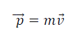
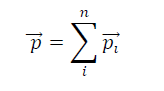
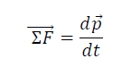
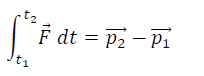
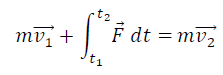
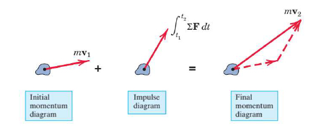
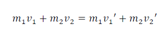
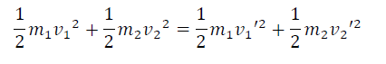
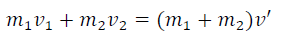
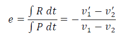

# Apparatus used: 
Linear Air track, Air blower, two gliders, two light gates, two retort stands, velcro-pads,
additional masses, data logger/acquisition system, computer system.

# THEORY
This experiment is devised to familiarize with the concept of impulse, momentum and coefficient of
restitution and to validate the law of conservation of linear momentum and conservation of energy as applied
to collision of objects on a linear air track.
### Momentum
A moving body possesses a quality which causes it to exert a force upon anything which tries to stop it. The
faster an object is traveling, or the more massive it is, the more difficult it is to stop. In mechanics, this
concept is termed as the linear momentum of the body. and is defined by the relation:
Momentum

  

 
Where m – mass of the object
v – velocity of the object
Linear momentum is a vector quantity having same direction as the velocity vector, i.e. tangent to the path.
For multiple objects in a system, the total momentum is a vector sum of the individual momenta

  

 
As opposed to the common convention to describe second law as ΣF=ma, Newton stated that the rate of
change in the momentum of an object is directly proportional to the amount of force exerted upon the object.
In mathematical terms, this differential equation can be written as:

  

 

### Impulse-Momentum Principle
In order to change the momentum of a particle, the resultant force should act over a period of time

  

 

This vector on the LHS is called the linear impulse of the force F during the interval and is denoted by the
term I. A more generalised form of the equation can be written as follows

  

 
This equation represents the Impulse-Momentum Principle and can be expressed in terms of impulsemomentum
diagrams

  

 

Impulse-Momentum principle is a powerful tool that can be applied for a system of particles in which the
forces that act on them exerts itself for a very short duration of time (impulsive forces). A classical example
of such type is the collision of bodies where the net impulse of bodies colliding is zero since the impact
forces are equal and opposite. The force of gravity generally has a negligible impulse, so it does not appear
in our calculations of impact. Since the effects of external impulses are very small, then the total linear
momentum before impact is equal to the total linear momentum after the impact

### Law of Conservation of Linear Momentum
For a closed system, the total momentum cannot change unless acted upon by an external force. In other
words, the total momentum for a system of isolated bodies is constant. This general law of nature is
commonly referred as the law of conservation of linear momentum.
For example, consider a one-dimensional collision of two objects along a straight line. The objects with
masses m1 and m2 have initial velocities v1 and v2, After collision, After the collision, the objects will have
new velocities v1’ and v2’, where all velocities are assumed to be in the positive direction. Conservation of
momentum demands that the total momentum must be the same before and after the collision. In other
words, if the momentum of one object decreases by a certain value, the momentum of the other object
increases by an equal amount.

  

 

Theoretically, there are two special kinds of collisions: the perfectly elastic and perfectly inelastic collisions.
While both of these processes conserve momentum, in the perfectly elastic collision the total kinetic energy,
is also conserved (no loss in KE).

  

 

In a perfectly inelastic collision, the objects which collide and stick together. Here the kinetic energy is not
conserved since some of the energy is lost into other forms

  

 

However, in most practical applications, collisions are neither perfectly elastic nor perfectly inelastic but
partially elastic. This means that the impulse during the period of deformation (deformation impulse) is
greater than the period of restitution (restitution impulse). In other words, the relative velocity of the
colliding objects before collision is greater than that after the collision. In this case, it is valuable to define a
quantity called the coefficient of restitution, a measure of the elasticity of the collision

  

 

For a perfectly elastic collision, e = 1 and for a perfectly inelastic collision (starting with two bodies and
ending with one), e = 0. For most real collisions, the coefficient of restitution has a value somewhere
between the two extremes (0 < e < 1)

### Experimental Setup

The experimental setup consists of an air track with the gliders that are subjected to collision. the An air
track is a perforated rail which is connected to an air blower. Compressed air is sprayed from the holes and
forms a thin layer on the surface of the track. This layer fills the space between the air track and the inner
surface of a glider. As a result, the movement of the glider can be regarded as almost friction-free.
The gliders have provision to attach velcro-pads on one side, which will allow the carts to stick together.
They also have provision to add extra weights
Please note that
* Do not slide the air gliders on the air-track without the air supply on
* Keep glider speeds less than 30 cm/s for best results.
  
### PROCEDURE
#### In real Laboratory
1. Connect the air blower to the linear air-track and adjust the air so that the glider just glides smoothly.
Check the air holes to clear any blockages due to grit or dust.
2. Adjust the air track feet so that the track is level. Use the bubble level to determine if the track is
level.
3. Fix the light gates on retort stands along the track and adjust the heights so that the light gates are
triggered when the gliders pass through them. Connect the gate to the digital timer/data acquisition
system
4. For in-elastic collisions, attach the velcro-pads at the colliding ends of the glider
5. Measure the masses of the of the gliders along with the extra weights and record them
6. Turn on the air blower for sometime before the air-track is ready for use.
7. Set Glider 1 at one end of the track and Glider 2 nearly in the middle of the track between the two
light gates.
8. Launch Glider 1 fairly fast enough by gently pushing it, passing through the first photogate to collide
with the Glider 2 which is at rest. Stop both the gliders immediately after it bounces of the bumper at
the ends of the track
9. Tabulate the time recorded as the gliders pass through the photo gates before and immediately after
the collision.
10. Repeat the experiment with different velocities and masses

#### In Simulation
1. Set the Type of Collision (elastic/non-elastic)
2. Use sliders to set up the mass of the gliders and velocity of the Glider 1.
3. Click the Play button to launch the gliders
